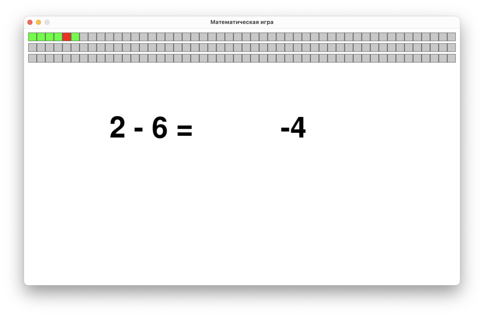
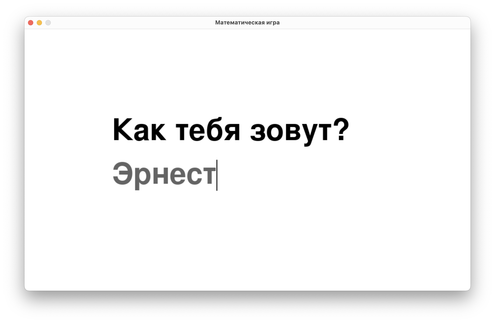

poetry run python main.py

# Математическая игра для детей

## Описание
Эта игра предназначена для обучения детей математике. Она предлагает задачи на сложение и вычитание с возрастающей сложностью. Пользователь вводит правильный ответ с клавиатуры, а игра проверяет его и дает обратную связь. Игра включает голосовое сопровождение, персонализированное обращение по имени и визуальные элементы для отслеживания прогресса.

---

## Особенности игры

### Персонализация
- При запуске игра спрашивает имя пользователя (с помощью голоса).
- Обратная связь содержит имя игрока, например: 
  - *"Правильно, Эрнест!"* 
  - *"Неправильно, Эрнест!"*.

### Голосовое сопровождение
- Задачи озвучиваются, например: 
  - *"Сколько будет 2 плюс 3?"*.
- Ответы подтверждаются голосом: 
  - *"Правильно!"* или *"Неправильно!"*.

### Визуальный прогресс
- В верхней части окна отображаются полоски с ячейками:
  - Зеленые ячейки означают правильные ответы.
  - Красные ячейки означают неправильные ответы.

### Три уровня сложности
1. **Уровень 1**: Числа от 1 до 9.
2. **Уровень 2**: Числа от 0 до 15.
3. **Уровень 3**: Числа от 0 до 20.

